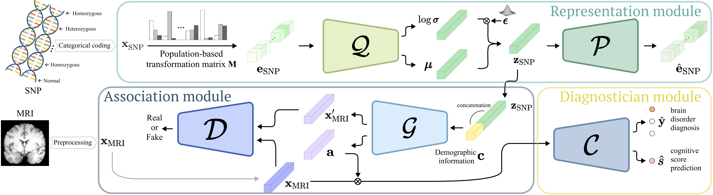
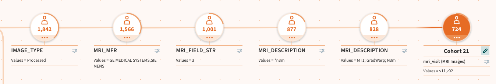

# AI Masters Program Practical Work: Alzheimer's classification
In this practical work the aim was to reproduce the paper [A Deep Generative-Discriminative Learning for Multi-modal Representation in Imaging Genetics](https://ieeexplore.ieee.org/stamp/stamp.jsp?tp=&arnumber=9434063).



## Dependencies
Dependencies can be found in the `requirements.yml` file. To install the dependencies, run:
```bash
conda env create -f requirements.yml
```

## Database extract
To reproduce the dataset, a database extract from ADNI must be obtained. The specific filters are specified as follows:



Images can be downloaded directly. For SNPs, simply download all VCF files from the ADNI database. 
For demographics, select MMSE score, diagnosis, subject age and biological sex and add them to the collection. This collection can then be downloaded as a CSV file.

## Preprocessing
Preprocessing is done in three steps:
1. MRI preprocessing
2. SNP preprocessing
3. Demographics preprocessing

### MRI preprocessing
The MRI preprocessing is done in the `mri-preprocessing.ipynb` notebook. The notebook reads the MRI data from the provided folder containing the .nii files and preprocesses them by:
1. Remove all samples where no genomic data is available
2. Create a BIDS dataset
3. Create batch file for Fastsurfer
4. Run Fastsurfer on the MRI data
5. Extract volumes from the Fastsurfer output and normalize by ICV

### SNP preprocessing
The SNP preprocessing is done in the `snp-preprocessing.ipynb` notebook. The notebook reads the SNP data from the provided .vcf files and preprocesses them by:
1. Select top SNPs from the ADVP database
2. Parse the .vcf files and extract the selected SNPs, categorizing into MISSING_CALL, REFERENCE, HETEROZYGOUS_ALT, HOMOZYGOUS_ALT

### Demographics preprocessing
The demographics preprocessing is done in the `demographic-preprocessing.ipynb` notebook. The notebook reads the demographics data from the provided .csv file and preprocesses them by:

1. Calculate patient age at the time of MRI scan
2. One-hot encode sex 
3. Get closes diagnosis and MMSE score to MRI scan date
4. Normalize MMSE score by min-max scaling


## Model and training
After preprocessing, model training can be performed using the `model.ipynb` notebook. The notebook reads the preprocessed data and trains the model as described in the paper.

Currently, the notebook is set up for multi-class classification.
For the binary classification task, the respective dataset must be specified and the target datatype changed to float32. A respective comment can be found in the dataset definition. 
